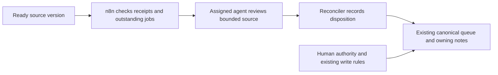

# Optional n8n handoff framework

An agent can leave a useful proposal in an outbox and still accomplish nothing because nobody starts the next review. This framework is the first step toward removing that manual handoff: notice new ready work, identify the assigned reviewer, and remember whether that specific version was reconciled.

**Version 0.1 is a dry-run reference, not a running agent service.** It includes a deterministic planner, fictional examples, automated tests, and an n8n workflow for inspecting the planner's decisions. It does not watch your files, wake an agent, store jobs, or write canonical notes. Those connections are explicitly specified and still need implementation and deployment tests.

Reality OS itself remains a portable, cooperative file protocol. n8n is an optional coordination adapter; the core contracts and manual workflow continue to work without it.

## First pilot

Start with one source and one recipient: a contributor's ready question outbox to the assigned Canonical Reconciler. In the reference deployment, that could be Claude's outbox to Codex. This does not assume that an API can wake a particular desktop chat or that a fresh API model has that chat's context, tools, or permissions.

The intended result is fewer manual handoffs and fewer stranded reviews during a normal workday. Use the laptop while it is awake, with a bounded work schedule and a catch-up scan when the service restarts. It does not need to become an always-on life-management service.



The diagram is the proposed deployment, not a claim that these connections ship here. A workflow finishing is not a receipt; a receipt is not necessarily canonical writeback; writeback is not an external outcome.

## Try the shipped dry run

From the repository root, with Node.js 22 or 24 and no package installation:

```sh
node --test integrations/n8n/planner.test.mjs
```

Import [`workflow.dry-run.json`](./workflow.dry-run.json) into n8n and execute its manual trigger. It contains only a Manual Trigger and a JavaScript Code node, uses fictional metadata, and has no credentials, file access, schedule, network requests, or agent invocation. Expected output:

| Scenario | Decision | Meaning |
|---|---|---|
| New item | `queue-review` | A ready version needs review. This output does not enqueue it. |
| Already reviewed | `skip` | Keep the existing disposition, including a deliberate deferral. |
| Withdrawn item | `request-terminal-receipt` | Ask the reconciler to acknowledge the lifecycle change without reopening the question. |
| Timeout with unknown effects | `needs-reconciliation` | Inspect the previous attempt's effects before considering a retry. |

The embedded JavaScript is exercised by the Node tests. **Import and execution inside an actual n8n instance have not yet been tested.** Record that result against your installed version before connecting real sources.

[`planner.mjs`](./planner.mjs) is the source of truth for the planner. Regenerate the example after changing it:

```sh
node integrations/n8n/build-workflow.mjs
node --test integrations/n8n/planner.test.mjs
```

## What needs connecting next

| Connection | Required behavior | v0.1 status |
|---|---|---|
| Source adapter | Read only allowlisted sources; parse complete items; hash stable source content; map existing IDs, lifecycle, and receipts. | Specified; not implemented. |
| Durable job store | Persist versions and receipts; atomically deduplicate and claim work; survive sleep and restart. | Specified; not implemented. |
| Agent runner | Invoke one explicitly configured recipient with bounded context and authority; recover uncertain attempts. | Specified; not implemented. |
| Receipt adapter | Read back the reconciler-owned disposition and any separately verified canonical consequence. | Specified; not implemented. |
| Scheduling and notification | Work-hour polling, restart catch-up, and notifications only for meaningful results or required action. | Specified; not implemented. |

The [adapter contract](./PROTOCOL.md) defines the connection boundaries and the normalized input. This envelope is an adapter format, not a new mandatory Reality OS outbox schema. No user should have to maintain a second human task queue.

## Pilot acceptance and stopping point

First prove the connection on an isolated synthetic outbox and target. The required deployment probes are recorded as **Specified—not yet empirically tested** in [the validation matrix](../../VALIDATION.md#optional-n8n-adapter-probes).

After those pass, use one explicitly authorized source for five workdays. Record eligible source versions, automatic versus manual handoffs, receipt latency while the laptop is available, duplicate reviews, false alerts, AI calls/cost, and minutes spent maintaining the automation. Do not count sleeping hours as failed dispatch latency.

The proposed pilot passes if at least 90% of eligible versions reach a review receipt without manual relay, no duplicate or unauthorized canonical change occurs, and the time saved exceeds maintenance time. Fewer than ten eligible versions is inconclusive; extend once or stop rather than manufacture a success claim. Pause on any unauthorized write, repeated duplicate dispatch, or unrecoverable missing receipt. Keep the manual path available throughout.

Do not add more integrations until this one route earns its complexity. Later candidates are resuming work when real evidence arrives and checking directly affected notes after a material change. Voice capture is a later option only if it solves an observed gap in the existing capture tool.

## Evidence and references

Local synthetic test evidence is in [the v0.1 run record](./validation/2026-09-06.md). It does not upgrade the core protocol's existing validation claims.

n8n documents its [Manual Trigger](https://docs.n8n.io/integrations/builtin/core-nodes/n8n-nodes-base.manualworkflowtrigger/), [Code node](https://docs.n8n.io/integrations/builtin/core-nodes/n8n-nodes-base.code/), and [Schedule Trigger](https://docs.n8n.io/integrations/builtin/core-nodes/n8n-nodes-base.scheduletrigger/). Check the installed version and deployment permissions before implementing the live adapter.
